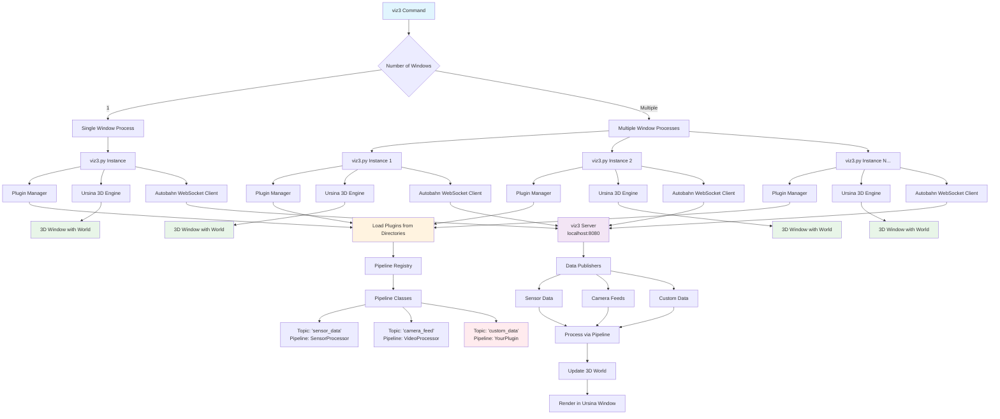

# Viz3 - 3D Visualization Tool

A 3D visualization tool for real-time 3D visualization and multi-window support.

## Architecture Overview

### System Architecture



### Data Flow

```mermaid
graph LR
    A[External Data Source] --> B[viz3 Server]
    B --> C[WebSocket Connection]
    C --> D[Autobahn Client]
    D --> E[Topic Subscription]
    E --> F{Pipeline Registry}
    F --> G[Matching Pipeline]
    G --> H[process&#40;world, data&#41;]
    H --> I[World Object Update]
    I --> J[Ursina 3D Rendering]
    J --> K[Visual Output]
    
    L[Plugin Directory] --> M[Plugin Manager]
    M --> N[Load .py Files]
    N --> O[Register Pipelines]
    O --> F
    
    P[User Input] --> Q[Window Controls]
    Q --> R[Move/Resize Window]
    
    style A fill:#ffcdd2
    style B fill:#f8bbd9
    style F fill:#e1bee7
    style G fill:#c5cae9
    style J fill:#bbdefb
    style K fill:#c8e6c9
    style L fill:#fff9c4
    style M fill:#ffecb3
```



### Key Components

1. **viz3 Command**: Main entry point that spawns one or more window processes
2. **Plugin Manager**: Dynamically loads Python files from plugin directories
3. **Pipeline Registry**: Maps topic names to processing pipeline classes
4. **Autobahn Client**: WebSocket client that connects to viz3 server
5. **Ursina Engine**: 3D rendering engine that creates interactive windows
6. **World Object**: Shared 3D scene state that pipelines can modify

### Plugin System

- **Dynamic Loading**: Plugins are `.py` files loaded at runtime from specified directories
- **Pipeline Registration**: Plugins register processing pipelines for specific data topics
- **External Libraries**: Plugins can use any Python library installed in the environment
- **Auto-Discovery**: All `.py` files in plugin directories are automatically loaded (except excluded files)

## Installation

### Development Installation
```bash
# Clone the repository
git clone <your-repo-url>
cd viz3

# Install in development mode
pip install -e .
```

### Regular Installation
```bash
pip install .
```

## Usage

After installation, you can run the tool from anywhere:

```bash
# Run with a single movable window
viz3

# Run with multiple windows
viz3 --number_of_windows_to_open 3 --window_width 800 --window_height 600

# Run with custom window positioning
viz3 --number_of_windows_to_open 2 --window_x_offset 100 --window_y_offset 80

# Run with borderless windows (no title bar, not movable)
viz3 --window_borderless --number_of_windows_to_open 2

# Run with resizable windows
viz3 --window_resizable --number_of_windows_to_open 1

# Run with plugin directories
viz3 --plugin-dir /path/to/plugins --plugin-exclude __init__.py --plugin-exclude test.py

# Run a single viz3 window directly (alternative entry point)
viz3-single --window_width 1024 --window_height 768 --host localhost --port 8080
```

## Command Line Options

### Window Configuration
- `--number_of_windows_to_open`: Number of windows to open (default: 1)
- `--window_width`: Width of each window in pixels (default: 600)
- `--window_height`: Height of each window in pixels (default: 500)
- `--window_x_offset`: X offset between multiple windows in pixels (default: 50)
- `--window_y_offset`: Y offset between multiple windows in pixels (default: 50)
- `--window_borderless`: Make windows borderless - removes title bar and makes windows unmovable (default: False)
- `--window_resizable`: Make windows resizable by dragging edges/corners (default: False)

### Network Configuration
- `--host`: Host address for the viz3 server (default: localhost)
- `--port`: Port number for the viz3 server (default: 8080)

### Plugin Configuration
- `--plugin-dir`: Add a plugin directory (can be used multiple times)
- `--plugin-exclude`: Files to exclude from plugin loading (can be used multiple times, default: __init__.py)

## Window Behavior

By default, viz3 creates windows with:
- **Title bars and borders** - making them fully movable with your mouse
- **Fixed size** - windows are not resizable unless `--window_resizable` is specified
- **Automatic positioning** - multiple windows are offset to prevent overlap

### Moving Windows
- **With title bar** (default): Drag the title bar to move the window
- **Borderless mode**: Windows cannot be moved as they have no title bar

### Multiple Windows
When opening multiple windows, each window is automatically positioned with offsets to prevent them from appearing on top of each other.

## Development

To work on this project:

1. Install in development mode: `pip install -e .`
2. Make your changes
3. Test with `viz3` commands
4. Run with different configurations to test window behavior 

## Commands

### `viz3` (Main Command)
The primary command that supports multiple windows and full window management features.

### `viz3-single` (Single Window)
A direct entry point that starts a single viz3 visualization window. This command supports all the same window configuration options as `viz3` but always creates exactly one window (ignoring `--number_of_windows_to_open`). 